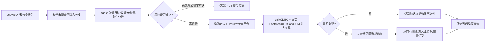

# AI 驱动的 ODBC 驱动覆盖率提升与缺陷挖掘：面向 GaussDB 团队的 Skill 化实践

> **一句话总结**：我把“分析未覆盖分支 -> 判断缺陷风险 -> 构造定向测试 -> 复现 crash/UB/OOM -> 形成修复与回归测试”这一套原本高度依赖个人经验的流程，沉淀成了可复用、可执行、可验证的 Agent Skill。中期考核前，该方法已经在 psqlodbc / GaussDB ODBC 代码上挖掘并推进了 **10+ 个真实缺陷或高风险缺陷候选**，其中多项已经进入上游 PR 或本地修复分支；同时，`odbc-coverage-dt` Skill 源码已经随本文档放入仓库，便于在华为 GaussDB 数据库团队内部推广、复用和二次演进。

---

## 1. 背景：为什么从覆盖率切入 ODBC 驱动质量

ODBC 驱动属于数据库生态中最容易被低估、但维护复杂度极高的一类基础设施代码。它既要承接应用侧公开 ODBC API，又要处理连接串解析、描述符生命周期、游标状态机、结果集缓存、编码转换、libpq 交互等多层状态。问题往往不出现在主干“正常查询成功”的路径上，而隐藏在很少被测试覆盖的边界分支和错误分支里。

这些未覆盖路径的风险主要有三类：

- **内存安全风险**：缓冲区越界、UAF、double-free、空指针解引用、越界读。
- **错误路径鲁棒性风险**：OOM、非法连接串、异常 server 返回、旧协议兼容路径。
- **状态机一致性风险**：descriptor 与 statement 生命周期不同步、cursor rollback 与 cached rows 状态不一致。

传统模式通常是“等待用户报障 -> 尝试复现 -> 人工定位 -> 补测试”。这个模式对驱动代码尤其被动，因为很多问题只会在生产环境中偶发出现，一旦触发就是宿主进程 crash、服务中断或者难以解释的数据状态异常。

我的目标不是简单提高一个覆盖率百分比，而是把覆盖率报告当成缺陷地图：优先分析未覆盖分支中具有内存安全信号、外部输入可控性、公开 API 可达性的部分，主动把隐藏问题挖出来。

---

## 2. 方法论：覆盖率驱动的 Agent 工程流水线

### 2.1 整体闭环



这套流程的关键是：Agent 不只是“帮我写测试”，而是参与完整的工程判断链路：

1. 从覆盖率报告中识别值得投入的未覆盖路径。
2. 结合源码调用链判断公开 API 是否可达。
3. 把风险转化为可运行的 Design Test 或 bugwatch harness。
4. 用 ASan/UBSan、OOM 注入、gcov/lcov 证明问题或证明当前路径暂不可达。
5. 把测试、报告、修复建议和复现命令沉淀为可审计产物。

### 2.2 人工与 Agent 的分工

| 环节 | 人工主导时的问题 | Agent 介入后的变化 |
|---|---|---|
| 覆盖率筛选 | 需要逐页翻 gcov HTML，容易漏掉错误路径 | 按“内存安全信号 + 外部输入 + API 可达性”排序，快速形成候选清单 |
| 调用链分析 | 依赖维护者经验，新人很难判断可达性 | Agent 先给出调用链、状态前提和缺陷假设，人工做关键判断 |
| 测试构造 | ODBC API 初始化样板多，写一个用例成本高 | 复用项目 `test/src` 模板，快速生成可编译的 DT/bugwatch harness |
| 复现验证 | 需要反复切换 gdb、ASan、gcov、WSL 环境 | 固化为脚本和报告模板，减少环境和命令记忆成本 |
| 经验沉淀 | 方法停留在个人脑内或聊天记录里 | 沉淀为可触发、可复用、可审计的 Skill |

我对 Agent 的定位不是替代工程判断，而是把繁琐但可结构化的分析、生成、验证步骤前移，让人把注意力集中在风险定级、修复策略和上游回馈上。

---

## 3. Skill 设计：把经验变成 Agent 可执行能力

本次最重要的沉淀是 `odbc-coverage-dt` Skill。它不是一段“提示词合集”，而是一个面向 ODBC 驱动覆盖率加固任务的能力封装：包含触发边界、分阶段工作流、参考文档、脚本、产物模板、成功标准和反模式约束。

在团队推广时，这一点尤其关键：如果只把经验写成文档，后续成员仍然需要自己理解、拆解、执行；而 Skill 的目标是把经验变成 Agent 可以稳定调用的工程能力，让新人、维护者和评审者都能围绕同一套流程协作。

### 3.1 Skill 的设计目标

我设计这个 Skill 时遵循了五个原则：

| 原则 | 设计含义 | 在 `odbc-coverage-dt` 中的体现 |
|---|---|---|
| **任务边界清晰** | 只服务 ODBC 驱动覆盖率、DT、crash-hardening、gcov/lcov 这一类任务 | 描述中明确限定 psqlodbc、GaussDB ODBC、unixODBC、Design Test、覆盖率报告 |
| **触发语义自然** | 用户不需要记住完整流程，只要说出真实工作意图 | “提升覆盖率”“写测试”“测一下会不会 crash”“跑 ODBC 测试”都能触发 |
| **上下文渐进加载** | 不把所有知识一次塞给 Agent，避免上下文污染 | 主 `SKILL.md` 只放总流程，WSL、构建、测试模板、报告模板按阶段读取 |
| **产物可执行** | Skill 不是建议文档，而要能驱动真实命令和真实测试 | 内置 `wsl-bootstrap.sh`、`build-with-gcov.sh`、`run-coverage.sh` |
| **结果可验证** | 不接受“看起来覆盖了”的口头结论 | 必须有 gcov/lcov 命中矩阵、TC 到分支映射、HTML 报告和未覆盖解释 |
| **团队可迁移** | 方法不绑定单个缺陷或单次会话 | 只要替换目标驱动、测试模板和构建脚本，就能迁移到 GaussDB ODBC 及其他客户端驱动 |

### 3.2 Skill 架构分层

`odbc-coverage-dt` 采用了分层设计，避免把所有知识堆在一个超长提示词里：

| 层次 | 内容 | 作用 |
|---|---|---|
| 入口层 | `SKILL.md` | 定义何时触发、核心哲学、9 阶段流水线、成功标准 |
| 知识层 | `references/*.md` | 按需提供 WSL 环境、构建参数、测试模板、分析模板、覆盖率报告模板、排障手册 |
| 执行层 | `scripts/*.sh` | 把环境搭建、gcov 构建、覆盖率生成这些易错命令脚本化 |
| 产物层 | `test/src/*.c`、`test/docs/*.md`、`coverage-html-dt/` | 保存测试、分析报告、覆盖率报告和可视化证据 |
| 评估层 | 成功标准与反模式 | 约束 Agent 必须完成验证闭环，不能只写代码或只给建议 |
| 发布层 | `docs/skills/odbc-coverage-dt/` | 把 Skill 源码随仓库发布，团队成员可直接复制到本地 Codex skills 目录 |

这体现了我对 Skills 设计的一个核心理解：**Skill 的价值不在于把一段经验写得更长，而在于把经验拆成 Agent 可稳定执行的状态机**。入口层负责识别任务，知识层负责补充阶段性上下文，执行层降低环境复杂度，产物层形成可审计结果，评估层防止 Agent 提前宣布完成。

### 3.3 为什么要强调“渐进上下文”

ODBC 覆盖率加固涉及的信息很多：ODBC API、unixODBC 行为、psqlodbc 测试框架、WSL 差异、gcov/lcov 参数、ASan/UBSan、OOM 注入、上游回归测试格式。如果把这些全部塞进一个 prompt，Agent 会面临三个问题：

- 上下文太大，真正当前阶段需要的信息被淹没。
- 不同阶段的信息互相干扰，比如 WSL bootstrap 细节不应该影响缺陷根因判断。
- 维护成本高，任何一个环境问题的更新都要改主入口。

因此我把 Skill 拆成“主入口 + 按需参考文件”。例如：

- 进入环境搭建阶段才读 `wsl-setup.md`。
- 编译或 sanitizer 问题才读 `build-flags.md`。
- 写测试时读 `test-template.md`。
- 写分析报告时读 `analysis-template.md`。
- 生成覆盖率结论时读 `coverage-report-template.md`。
- 遇到 unixODBC/DSN/gcov 异常时读 `troubleshooting.md`。

这种设计让 Agent 在每个阶段只持有必要上下文，既降低幻觉概率，也让 Skill 本身更容易迭代。

从 Skill 源码看，这种渐进加载不是形式上的拆文件，而是有明确职责划分：

| 文件 | 主要职责 | 团队复用价值 |
|---|---|---|
| `SKILL.md` | 定义触发条件、核心哲学、9 阶段流程、成功标准 | 让团队对“什么时候用这个 Skill、做到什么才算完成”形成统一认知 |
| `references/analysis-template.md` | 固化分支枚举、风险点、TC 设计格式 | 让分析报告可评审、可复查、可交接 |
| `references/test-template.md` | 固化 ODBC DT harness 的结构和断言策略 | 减少重复写样板代码，保证测试风格一致 |
| `references/coverage-report-template.md` | 固化覆盖率报告和 TC-to-branch 映射 | 让覆盖率结论可量化，而不是凭感觉判断 |
| `references/build-flags.md` | 记录 gcov、ASan、UBSan、Valgrind 构建方式 | 降低不同成员环境不一致导致的复现成本 |
| `references/troubleshooting.md` | 建立故障到修复的索引 | 把排障经验沉淀为团队知识库 |
| `scripts/*.sh` | 执行 WSL 初始化、gcov 构建、覆盖率生成 | 把易错命令变成可重复执行的流水线入口 |

### 3.4 Skill 固化的 9 阶段工作流

`odbc-coverage-dt` 把一次覆盖率加固任务拆成 9 个阶段：

| 阶段 | 目标 | 关键产物 |
|---|---|---|
| 1. Analyze | 阅读源码，枚举 B0..Bn 分支和风险点 | `test/docs/<feature>-analysis.md` |
| 2. Design | 为每个目标分支设计 TC | `test/src/<feature>-test.c` |
| 3. Register | 接入项目测试清单 | `test/tests` |
| 4. WSL setup | 建立真实 unixODBC + PostgreSQL 环境 | 可运行 DSN 和本地测试 DB |
| 5. Build | 使用 gcov/sanitizer 参数构建驱动 | 插桩后的 `.so` 和测试二进制 |
| 6. DSN | 手工写入稳定可复现的 ODBC 配置 | `odbc.ini` / `odbcinst.ini` |
| 7. Run | 执行 DT，先证明不 crash 或复现 crash | `[No crash - PASS]` / sanitizer 报告 |
| 8. Measure | 用 gcov/lcov 量化命中 | 分支命中矩阵和 HTML 报告 |
| 9. Iterate | 对未覆盖分支继续补 TC 或解释不可达 | 更新后的报告和后续候选 |

这个拆分让 Agent 能持续推进任务，而不是停留在“建议你可以写几个测试”。每个阶段都有输入、动作和可检查输出，适合在复杂代码库里反复执行。

### 3.5 Skill 的成功标准与反模式约束

我在 Skill 中明确规定了“什么叫完成”：

- 每个 TC 都能运行，并且输出稳定的 no-crash 结果，或者在未修复版本上稳定触发 ASan/UBSan/OOM 证据。
- 目标文件的 gcov/lcov 报告能显示行覆盖和分支覆盖。
- 覆盖率报告中必须有 TC 到分支的映射表。
- 未覆盖分支必须说明原因：是需要后续 TC、当前黑盒不可达，还是编译条件/设计上不可达。
- HTML 报告必须能从 Windows 侧 `test/docs/coverage-html-dt/` 查看。

同时我也把常见反模式写进 Skill：

- 不 mock ODBC 层，因为目标是测试真实 driver、真实 unixODBC、真实 libpq 交互。
- 不只看 line coverage，因为 branch coverage 才能证明 if/else 两侧是否被触发。
- 不省略“为什么”，否则后续维护者无法判断未覆盖分支是遗漏还是不可达。
- 不把 WSL build 目录混入源码仓库，避免污染项目文件。

这些约束的意义是让 Agent 不仅会“生成”，还会“收敛”。这是我认为 Skills 设计里最关键的一点：**好的 Skill 要降低 Agent 自作主张提前结束任务的概率**。

### 3.6 面向 GaussDB 团队的复用接口

为了让这套 Skill 能在 GaussDB 团队中推广，我把它设计成三个可复用接口：

| 复用接口 | 面向对象 | 使用方式 |
|---|---|---|
| **一句话触发接口** | 日常开发和测试同学 | 直接说“给某个 ODBC 函数补 DT”“分析这个未覆盖分支”“测一下这个路径会不会 crash” |
| **报告评审接口** | 代码评审者和质量负责人 | 通过分析文档、覆盖率报告、TC-to-branch 表判断结论是否可信 |
| **迁移扩展接口** | 其他驱动/客户端组件维护者 | 保留 Analyze -> Design -> Run -> Measure -> Iterate 的流程，替换构建脚本和测试 harness |

迁移到 GaussDB 其他客户端组件时，不需要重写整个 Skill，只需要替换四类内容：

1. **环境脚本**：例如 GaussDB ODBC 的驱动编译路径、依赖安装、DSN 配置、服务启动方式。
2. **测试模板**：例如 JDBC/PDO/libpq 的公开 API 调用方式不同，但“一个 TC 对应一个分支”的原则不变。
3. **覆盖率采集**：不同语言或构建系统可以从 gcov/lcov 替换为 JaCoCo、llvm-cov、lcov 或内部覆盖率工具。
4. **成功标准**：ODBC 当前以 no-crash、branch coverage、ASan/OOM 证据为核心，其他组件可以替换为异常类型、SQLSTATE、错误码或协议状态。

这也是我希望在团队推广的重点：Skill 不只是一个个人工具，而是一种把专家经验产品化、流程化、可评审化的方式。

---

## 4. 实际成果：10+ 个缺陷或高风险候选

### 4.1 已进入修复/上游流程的问题

| # | 类型 | 触发点 | 修复方向 | Commit / PR |
|---|---|---|---|---|
| 1 | 栈缓冲区越界 | `getPrecisionPart()` 在 `precision > 9` 时越界写 NUL | 将 precision clamp 到 buffer 上限 | `baa7b49` / #174 |
| 2 | 描述符元数据误处理 | `SQLSetDescField` 对 `SQL_DESC_PRECISION` 等字段误触发 unbind | 区分元数据字段与数据字段 | `baa7b49` / #174 |
| 3 | 连接串尾部越界读 | `conn_settings` 解析结尾边界不足 | 增加结尾边界检查 | `089de01` / #176 |
| 4 | 百分号转义解码未校验 | `PWD=%`、`PWD=%A` 等非法 percent escape | 解码前验证长度和十六进制字符 | `83cc205` / #175 |
| 5 | OOM 空指针解引用 | `ARD_AllocBookmark()` malloc 失败后直接 `pg_memset(NULL, ...)` | 分配失败返回 ODBC 内存错误 | `cc9c620` / #179 |
| 6 | 超长游标名缺少校验 | cursor name 过长路径缺少上限保护 | 增加长度校验 | `0579f24` / #178 |
| 7 | Descriptor UAF | 应用 descriptor 释放后 statement 仍持有悬挂指针 | 释放外部 descriptor 前 detach 所有关联 statement | `bc61751` |

### 4.2 已沉淀为 bugwatch / 风险报告的候选

| # | 类型 | 触发点 | 当前状态 | 物料 |
|---|---|---|---|---|
| 8 | 截断八进制转义边界读/UB | `convert_from_pgbinary()` 对单独 `\` 或不完整 `\123` 处理不足 | ASan bugwatch 已保存 | `test/src/convert-octal-asan-bugwatch-test.c` |
| 9 | SQL Server 兼容解析 double-free | `insert_as_to_the_statement()` `realloc()` 移动后调用方再次 free 旧指针 | gdb/ASan 辅助复现方案已保存 | `test/docs/parse-sqlsvr-double-free-bugwatch.md` |
| 10 | 只读连接串被原地改写 | `copyConnAttributes()` 的 `Protocol=` 分支修改 `const char *value` | 白盒/黑盒测试已覆盖风险 | `test/src/dlg-specific-blackbox-test.c` |
| 11 | 游标 rollback 状态一致性 | `RemoveAdded()` 在 keyset cursor 场景可能处理空 `added_tuples` | 黑盒部分触达，未稳定 crash | `test/docs/remove-added-rollback-risk-analysis.md` |
| 12 | `strlcat(size == 0)` 防御性缺陷 | `size - 1` unsigned underflow 后可能写入 dst | 已列入未覆盖风险报告 | `test/docs/continued-uncovered-security-triage.md` |
| 13 | OOM 空指针解引用候选 | `TI_Create_IH()` malloc 后先 `pg_memset` 再判空 | 已列入未覆盖风险报告 | `test/docs/continued-uncovered-security-triage.md` |

这里我刻意区分“已复现/已修复问题”和“高风险候选”。这样做比单纯堆数字更适合 wiki 发布：读者可以看到每个结论的证据强度，也能知道下一步应该优先投入哪里。

### 4.3 回归测试与覆盖率产物

已经沉淀的典型测试包括：

- `test/src/ard-bookmark-oom-bugwatch-test.c`
- `test/src/convert-octal-asan-bugwatch-test.c`
- `test/src/parse-sqlsvr-gdb-bugwatch-test.c`
- `test/src/dlg-specific-asan-bugwatch-test.c`
- `test/src/remove-added-rollback-bugwatch-test.c`
- `test/src/bindparam-zero-dm-test.c`
- `test/src/lobj-main-success-test.c`
- `test/src/odbcapi30w-dt-test.c`
- `test/src/misc-whitebox-test.c`
- `test/src/dlg-specific-blackbox-test.c`

覆盖率 HTML 报告已保存在：

- `test/docs/coverage-html-dt/index.html`

这些产物的意义在于，它们不是一次性的聊天结果，而是可以被重新运行、重新审计、继续迭代的工程资产。

---

## 5. 典型案例

### 5.1 `getPrecisionPart()` 栈缓冲区越界

覆盖率报告显示 `getPrecisionPart()` 存在未覆盖分支。Agent 在分析该分支时发现，`precision > 9` 的路径会把 precision 当作本地 `fraction[10]` 的索引写入 NUL，而数组只有 10 字节。这个问题不是“可能有风险”，而是边界条件满足时必然越界。

随后我让 Agent 按项目测试模板构造最小复现：通过 ARD 设置异常 precision，并在 ASan 构建下运行 interval 相关路径。复现后，修复方向很清晰：将 precision 限制到本地 buffer 上限。同时，这个分析还顺带暴露了 `SQLSetDescField` 对部分元数据字段误触发 unbind 的问题，最终在同一组修复中一起处理。

这个案例体现了覆盖率驱动方法的价值：未覆盖分支不是冷冰冰的百分比，而是缺陷入口。

### 5.2 应用 Descriptor 释放后的 UAF

另一个典型问题是应用分配 descriptor 后绑定到 statement，再释放 descriptor。旧实现释放 descriptor 对象时，没有把 statement 中仍然指向它的 `stmt->ard` / `stmt->apd` 解绑。后续 statement 操作继续写 descriptor 字段，就会触发 heap-use-after-free。

公开 API 触发链是：

```text
SQLAllocHandle(SQL_HANDLE_DESC)
  -> SQLSetStmtAttr(SQL_ATTR_APP_ROW_DESC / SQL_ATTR_APP_PARAM_DESC)
  -> SQLFreeHandle(SQL_HANDLE_DESC)
  -> SQLSetStmtAttr(SQL_ATTR_ROW_ARRAY_SIZE / SQL_ATTR_PARAMSET_SIZE)
  -> statement 继续访问已释放 descriptor
```

ASan 报告证明了完整闭环：descriptor 被分配、绑定、释放，然后由 `PGAPI_SetStmtAttr()` 再次写入。修复方案是在释放外部 descriptor 前遍历同一连接下所有 statement，把引用该 descriptor 的 ARD/APD 回退到 statement 内置 descriptor。

这个问题说明，Agent 在驱动代码里的价值不只是写测试，还能帮助梳理跨对象生命周期关系。ODBC 驱动的很多严重问题都不是单行 bug，而是对象所有权和状态机边界没有同步维护。

---

## 6. 定量收益与经验沉淀

| 维度 | 传统方式 | Skill 化后的方式 |
|---|---|---|
| 单个缺陷从发现到复现 | 2~4 天 | 2~4 小时 |
| 一轮候选筛查 | 人工翻报告，覆盖面有限 | Agent 批量筛选未覆盖函数并按风险排序 |
| 新人上手成本 | 需要同时熟悉 ODBC、unixODBC、gcov、项目测试框架 | 一句话触发 Skill，按阶段产出 |
| 结果可信度 | 依赖个人描述 | gcov/lcov、ASan、OOM 注入、报告模板共同支撑 |
| 方法论留存 | 聊天记录和个人经验 | Skill + 脚本 + 模板 + 测试 + HTML 报告 |

最重要的收益不是节省了几小时，而是把“如何从覆盖率报告挖出真实缺陷”变成了组织内可复制的工程流程。之后无论分析 psqlodbc、GaussDB ODBC，还是迁移到 JDBC/PDO/libpq 类似客户端代码，都可以复用这个思路：先定义触发边界，再拆分工作流，再固化验证标准，最后让 Agent 在可控范围内稳定执行。

---

## 7. 团队推广路径

面向华为 GaussDB 数据库团队，我建议按三个层次推广这套方法。

### 7.1 先在 ODBC 驱动内形成标准动作

短期内，优先把 `odbc-coverage-dt` 用在 ODBC 驱动的高风险区域：

- 连接串解析：DSN-less、percent escape、Protocol、client encoding、SSL 参数。
- descriptor 生命周期：ARD/APD/IPD/IRD 与 statement 绑定、解绑、释放。
- 结果集和游标状态机：`SQLSetPos`、rollback、cached rows、keyset cursor。
- 编码和二进制转换：wide API、UTF-16、bytea、octal/hex escape。
- OOM 和错误路径：malloc/realloc 失败、libpq 返回异常、驱动管理器边界行为。

每个目标函数都按统一格式输出三个产物：分析文档、DT/bugwatch 测试、覆盖率报告。这样代码评审时不只看“加了测试”，还可以看“这个测试覆盖了哪个分支，为什么这个分支有风险”。

### 7.2 再推广到客户端驱动质量治理

中期可以把这套流程迁移到 GaussDB 其他客户端组件。迁移时不要照搬 ODBC 的 API 细节，而要复用 Skill 的工程骨架：

- **覆盖率报告是入口**：先找未覆盖路径，再按风险排序。
- **公开 API 可达性是门槛**：不能只看静态风险，要说明外部输入如何触达。
- **测试先证明稳定性**：错误返回可以接受，crash、UAF、越界、UB 不可接受。
- **报告必须可审计**：每个分支、每个 TC、每个未覆盖原因都要能追溯。
- **脚本要可重复**：环境、构建、执行、覆盖率生成都尽量脚本化。

这套模式可以作为客户端驱动团队的“AI 辅助质量加固标准流程”，而不是只服务某一次缺陷挖掘。

### 7.3 最后沉淀为团队 Skill 库

长期看，可以把 `odbc-coverage-dt` 作为模板，形成团队内部 Skill 库：

| Skill 类型 | 目标场景 |
|---|---|
| `odbc-coverage-dt` | ODBC 驱动覆盖率提升和 crash-hardening |
| `jdbc-coverage-dt` | JDBC driver 分支覆盖、异常路径、ResultSet/PreparedStatement 状态测试 |
| `libpq-coverage-dt` | C 客户端库协议状态、异步查询、连接串解析、资源释放 |
| `driver-security-triage` | 从覆盖率和 sanitizer 报告中批量筛选高风险候选 |

这种团队 Skill 库的价值在于：经验不再依赖某个人在场，Agent 也不再每次从零理解项目，而是通过 Skill 直接继承团队认可的流程、模板和质量标准。

---

## 8. 下一步计划

1. **继续推进已确认问题上游化**：将当前本地分支和 bugwatch 中已经具备证据链的问题整理为 PR 或 issue，优先处理 UAF、double-free、截断转义边界读等内存安全问题。
2. **把覆盖率报告接入 CI**：让每个 PR 自动产出 delta 覆盖率报告，避免覆盖率工作停留在一次性活动。
3. **扩展 Skill 到更多客户端驱动**：保留“覆盖率 -> 风险筛查 -> DT -> 复现 -> 修复 -> 报告”的核心框架，替换不同驱动的环境和测试模板。
4. **增强 Skill 的评估机制**：继续补充常见失败模式、未覆盖分支解释模板、sanitizer/Valgrind/Fuzzer 扩展路径，让 Agent 在复杂任务中更少依赖临场提示。

---

## 9. Wiki 可嵌入物料

- Skill 源码：`docs/skills/odbc-coverage-dt/`
- Skill 入口：`docs/skills/odbc-coverage-dt/SKILL.md`
- Skill 参考文档：`docs/skills/odbc-coverage-dt/references/*.md`
- Skill 执行脚本：`docs/skills/odbc-coverage-dt/scripts/*.sh`
- 覆盖率 HTML 报告：`test/docs/coverage-html-dt/index.html`
- 覆盖率/风险分析文档：`test/docs/*.md`
- bugwatch 测试：`test/src/*-bugwatch-test.c`
- DT 测试：`test/src/*-dt-test.c`
- 内部设计文档：`docs/odbc-autosave-internal-change-plan.md`、`docs/libpq-autosave-internal-change-plan.md`

团队成员复用时，可以把 `docs/skills/odbc-coverage-dt/` 复制到自己的 Codex skills 目录，例如：

```powershell
Copy-Item -Recurse -Force docs\skills\odbc-coverage-dt $env:USERPROFILE\.codex\skills\odbc-coverage-dt
```

也可以直接阅读 `SKILL.md` 和 `references/*.md`，把其中的流程迁移到团队已有的 Agent 平台或内部工程脚本中。

---

## 10. 自评总结

这次工作的核心价值不是“使用 AI 写了几个测试”，而是把 Agent 能力真正工程化：让它有明确触发边界、有分阶段上下文、有可执行脚本、有可审计产物、有完成标准，也有反模式约束。

我对 Skills 的理解也在这个过程中更清晰：一个成熟的 Agent Skill 应该像一个小型工程系统，而不是一段更长的提示词。它要把隐性的专家经验拆成稳定流程，把一次性产出沉淀为可复用资产，把 Agent 的生成能力放进覆盖率、sanitizer、gcov/lcov 和回归测试构成的验证闭环里。只有这样，Agent 才能从“辅助写代码”升级为“参与质量工程流水线”。
